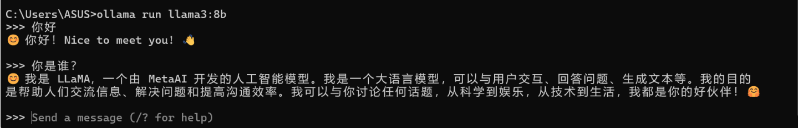
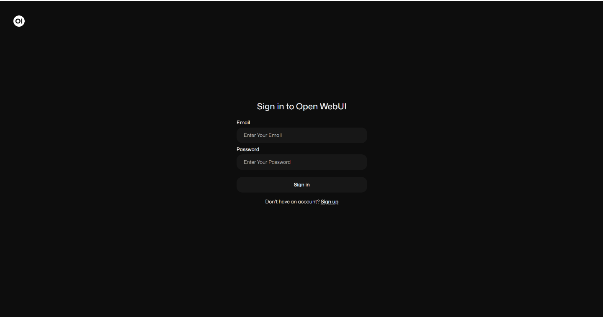
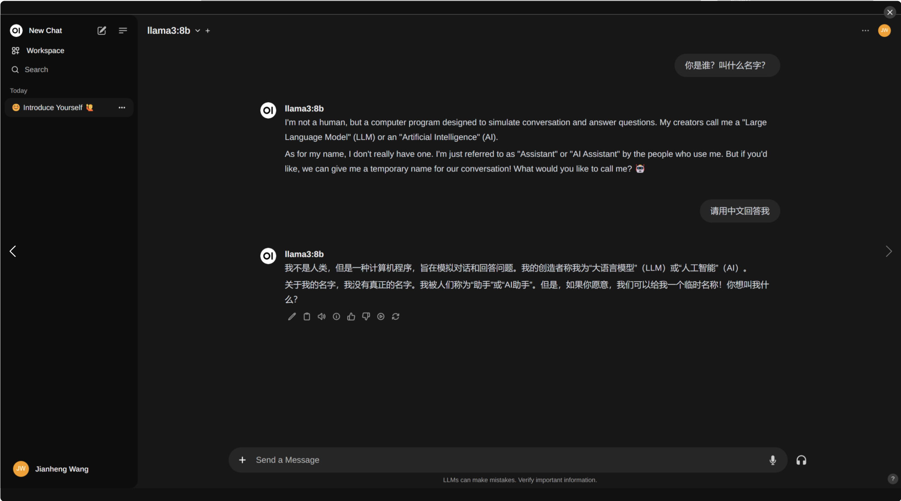
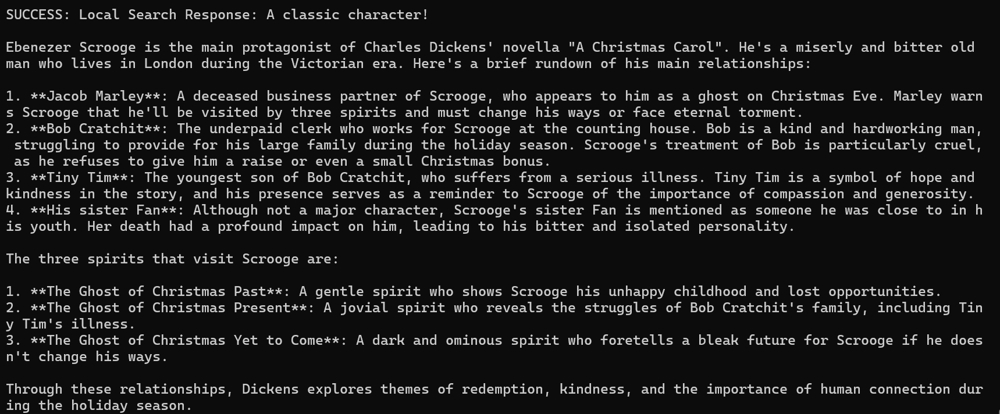
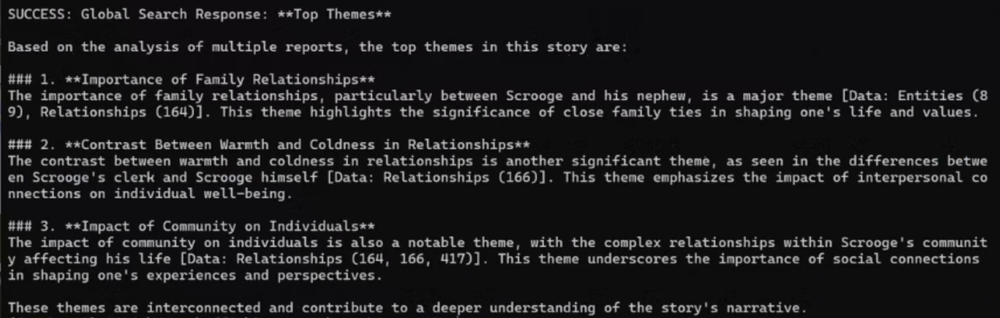

"# GraphRAG-with-Llama-3.1" 

## 安装 Ollama
[Ollama+Open WebUI本地部署Llama3 8b](https://blog.csdn.net/qq_53795212/article/details/139690567)  
下载网址：https://ollama.com/download  

1. cmd 中下载 llama3 模型    
`ollama pull llama3:8b`
2. 下载 nomic-embed-text 模型
`ollama pull nomic-embed-text`
3. 启动 llama3 模型，并对话
`ollama run llama3:8b`
  
4. 通过 docker 下载 Open WebUI (docker要开启)
`docker run -d -p 3000:8080 --add-host=host.docker.internal:host-gateway -v open-webui:/app/backend/data --name open-webui --restart always ghcr.io/open-webui/open-webui:main`
5. 安装后，可以通过http://localhost:3000访问 Open WebUI   
  
6. 创建账户并登录后，左上角模型选择我们之前下好的llama3:8b，就可以开始对话了

## 安装 GraghRAG，并配置环境(官方案例)
[GraphRAG 微软网址](https://microsoft.github.io/graphrag/posts/get_started/)  
[本地LLM模型运行微软GraphRAG步骤指导](https://www.bilibili.com/video/BV18HeFetELw?p=1&vd_source=52fd27260df9b91088b22968ad3bb521)  

1. Anaconda Powershell 中新建一个 graphrag 的虚拟环境  
`conda create -n graphrag python=3.11`  
`conda activate graphrag`

2. 安装 graphrag  
`pip install graphrag`

3. 创建目录和文件夹  
`cd D:\00_AI\Projects\GraphRAG`  
`mkdir -p ./ragtest/input`  

4. 把文档 book.txt 放到 ./ragtest/input/book.txt  

5. 初始化环境  
`python -m graphrag.index --init --root ./ragtest`  

6. 替换以下文件(data里有替换文件)  
./ragtest/settings.yaml  
./ragtest/prompts/community_report.txt  
~anaconda3/envs/graphrag/Lib/site-packages/graphrag/query/llm/oai/embedding.py  
~anaconda3/envs/graphrag/Lib/site-packages/graphrag/llm/openai/openai_embeddings_llm.py  

    - settings.yaml 修改境外模型为开源模型和本地接口   
    - community_report.txt 把 {{ }}-->{} 防止json不识别，pipeline出现index错误  
    - embedding.py 添加了ollama接口的 nomic-embed-text 模型，原文是openai的embedding模型      
    - openai_embeddings_llm.py 修改 embedding 模型为 nomic-embed-text    
    - 详情见images文件夹里图片  

7. 安装 ollama (graphrag 是跟 ollama 的 API 交互的)   
`pip install ollama`

8. 测试运行pipeline  
`python -m graphrag.index --root ./ragtest`
- Reading settings from ragtest\settings.yaml
- create_base_text_units
- create_base_extracted_entities
- create_summarized_entities
- create_base_entity_graph
- create_final_entities
- create_final_nodes
- create_final_communities
- join_text_units_to_entity_ids
- create_final_relationships
- join_text_units_to_relationship_ids
- create_final_community_reports
- create_final_text_units
- create_base_documents
- create_final_documents
- All workflows completed successfully.  
经历漫长的过程，终于结束了...

9. 测试运行query   
- 特定的问题，用 local 查询  
`python -m graphrag.query --root ./ragtest --method global "What are the top themes in this story?"`

- 宏观的问题，用 global 查询  
`python -m graphrag.query --root ./ragtest --method local "Who is Scrooge, and what are his main relationships?"`  

